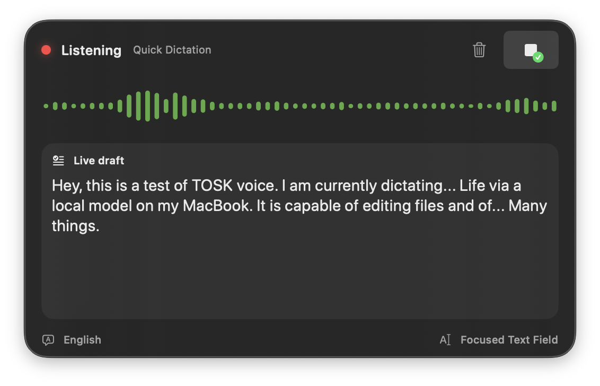

# ToskVoice



ToskVoice is a native, local-first macOS menu-bar dictation app for Apple Silicon Macs running macOS 26 or newer. It focuses on fast voice input, visible live feedback, local speech models, and privacy-preserving editor workflows.

## Features

- Nonactivating dictation overlay that keeps focus in the target application.
- Menu-bar waveform with click-to-toggle dictation and right-click settings.
- Live waveform, provisional text, and finalized text using Apple's on-device `SpeechAnalyzer`.
- English, German, and automatic bilingual profiles with custom vocabulary.
- Configurable global shortcuts, including toggle and push-to-talk modes.
- Focused-field insertion through Accessibility, with clipboard fallback when direct insertion is unavailable.
- Timestamped Markdown transcript output.
- Spoken correction handling, including natural phrases such as "strike that," "undo sentence," "replace X with Y," and German equivalents.
- Optional Apple Intelligence processing for live draft edits and polished final text.
- Local editable transcript history. Raw microphone audio is not retained.
- Selectable microphones and output devices.
- Optional WhisperKit, SpeakerKit, and Qwen3 TTS model packs with visible download/load state.
- Optional SpeakerKit diarization with time-aligned speaker labels.
- Text-to-speech from selected text or files using macOS voices, optional Qwen3 neural voices, and WAV/MP3 export.
- File-only Voice Editor with Apple Intelligence or an OpenAI-compatible endpoint, approved workspace roots, native diff review, atomic writes, and undo.
- Bundled Zed ACP agent and installable Obsidian companion.

All downloaded speech models run locally after installation. External editor providers are used only when explicitly selected and configured.

## Requirements

- Apple Silicon Mac.
- macOS 26 or newer.
- Xcode with the macOS 26 SDK for local builds.
- Microphone permission for recording.
- Accessibility permission for inserting dictated text and posting fallback paste events.

## Quick Start

Build and open the app:

```sh
./build open
```

The first launch may require granting permissions under **Settings -> Privacy**. After granting Accessibility, use **Restart ToskVoice** in the Privacy tab so macOS applies the change to the running app.

Shortcuts are configurable in Settings. The defaults are `Control-Option-Space` for toggle and `Control-Option-D` for push-to-talk.

## Development

Run tests:

```sh
./build test
```

Build the app bundle:

```sh
./build
```

Create a release archive:

```sh
./build archive
```

Install and open a release build locally:

```sh
./build archive install
```

`archive` creates an arm64 ZIP plus SHA-256 checksum in `artifacts/`. It includes the Zed ACP helper, Obsidian companion, and LAME encoder.

The build script prefers `/Applications/Xcode.app` when installed. If `TOSKVOICE_SIGNING_IDENTITY` is unset, it tries to use the first Apple Development or Developer ID Application signing identity. If none is available, it falls back to ad-hoc signing, which can cause macOS privacy grants to reset after rebuilds.

SwiftPM downloads pinned source dependencies automatically. The small arm64 LAME executable and license texts are vendored for reproducible MP3 export builds. The root `Brewfile` remains available for refreshing that tool.

## Voice Editor

Open **Voice Editor...** from the right-click menu, approve a workspace root, and choose either Apple Intelligence or an OpenAI-compatible API. Endpoint and model metadata stay in preferences; API keys are stored in macOS Keychain. A common local configuration is an Ollama-compatible `/v1` endpoint with no API key.

The native editor validates model-proposed relative paths against the approved root, rejects symlink escapes and stale file contents, defaults to preview-before-apply, and writes changes atomically. Auto-apply is an explicit per-workspace option.

## Zed and Obsidian

The Voice Editor window can copy the Zed `agent_servers` configuration for the bundled `toskvoice-agent`. The helper implements ACP protocol version 1, reads supported text files below Zed's project `cwd`, has no terminal tool, and reports file diffs back to Zed.

Use **Install Obsidian Companion...** to copy the plugin into a chosen vault. Its command sends the current note path and selection through the `toskvoice://edit` handoff. ToskVoice still requires the vault to be an approved workspace before it can change files.

## Homebrew

The cask template lives at `Packaging/homebrew/tosk-voice.rb` and targets `kellertobias/homebrew-tap`. Before notarization, releases require Homebrew's `--no-quarantine` option as documented by the cask. A local archive can also be installed with `./build archive install`.

## Privacy

Speech recognition, diarization, Apple Intelligence corrections, and local TTS run on this Mac. ToskVoice stores preferences and transcript history in the user's Library. It does not retain raw audio.

Voice Editor workspace contents leave the Mac only when an external provider is selected. The UI identifies that provider before a request is sent.

## Project Status

ToskVoice is early-stage software. The repository is public for inspection and collaboration, but release signing, notarization, and packaged distribution are still being finalized.

## License

Copyright (c) 2026 Tobisk. All rights reserved until a project license is selected.
